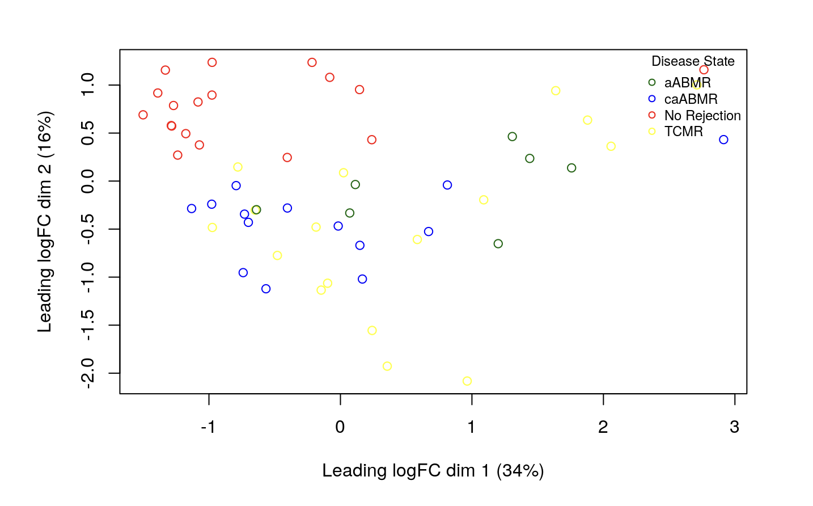
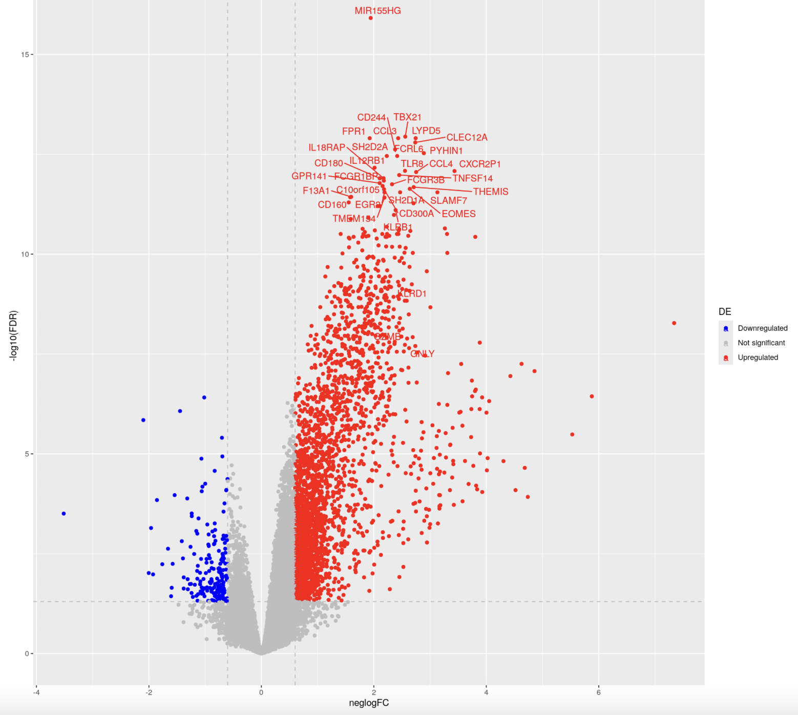
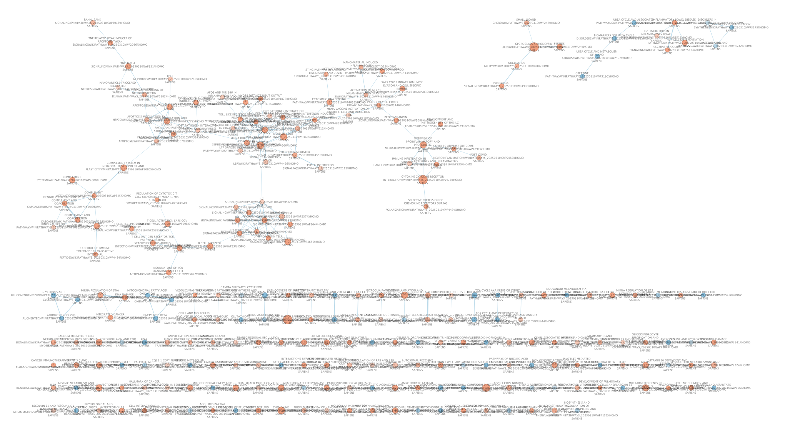
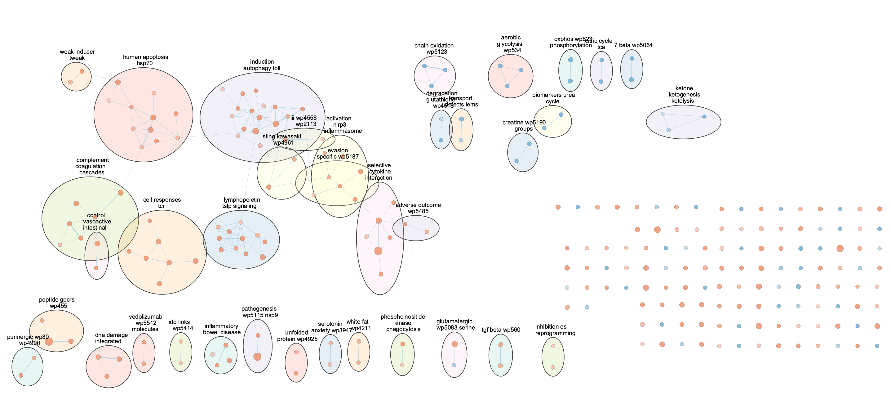
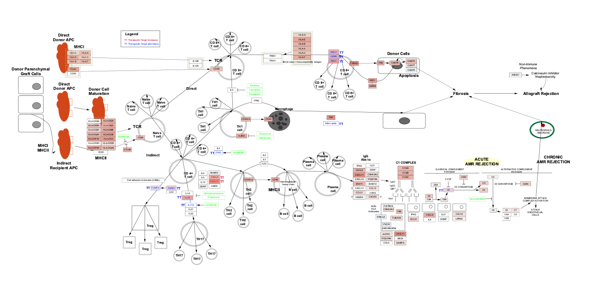

```{r include = FALSE}
knitr::opts_chunk$set(message = FALSE)
```

```{r, include=FALSE}
library(dplyr)
```

# Assignment 3: Differential Gene Expression and Preliminary ORA

## Introduction

### Background

In Assignment 1, the primary objective was to retrieve and preprocess RNA-seq data from the Gene Expression Omnibus (GEO) database. The dataset chosen for analysis, GSE232825, pertains to transcriptomic profiling of chronic active antibody-mediated rejection (caABMR) in human kidney allografts. Using GEO’s NCBI-generated RNA-seq count data feature, raw count data were downloaded and preprocessed. The dataset was then normalized and structured into a count matrix, with samples labeled according to their disease state (caABMR, No Rejection, or TCMR). The processed dataset was stored for downstream analysis. Initial exploratory visualizations, including box plots and density plots, confirmed that normalization was sufficient, ensuring that the dataset was ready for differential expression analysis.

```{r, echo=FALSE, fig.cap="Figure 1. MDS plot showing separation of samples, coloured by disease state."}

```

Assignment 2 focused on differential gene expression (DGE) analysis and preliminary over-representation analysis (ORA). The study aimed to compare transcriptomic differences between caABMR and non-rejecting samples to identify differentially expressed genes (DEGs) associated with rejection pathology. The EdgeR package was used for DGE analysis due to its robust handling of RNA-seq count data. A multidimensional scaling (MDS) plot demonstrated a clear separation of samples based on disease state, justifying the model design. The differential analysis identified a significant set of DEGs, with the quasi-likelihood F-test used to calculate p-values. Adjusted p-values (FDR < 0.05) helped to refine the list of significantly altered genes.

Key results were visualized using volcano plots, which highlighted upregulated immune-related genes such as CCL3, CCL4, IL12RB, and NK cell-associated genes like KLRB1, KLRC1, and GZMB in caABMR samples. A heatmap further confirmed differential clustering patterns, revealing potential sample heterogeneity within the caABMR group. The preliminary ORA aimed to assess pathway enrichment in upregulated, downregulated, and overall differentially expressed genes, focusing on Gene Ontology (GO) biological processes and KEGG pathways relevant to immune activation and rejection mechanisms.

```{r, echo=FALSE, fig.cap="Figure 2. Volcano plot showing differentially expressed genes between caABMR and non-rejecting samples, with the top 30 DE genes (by p value) labelled."}

```

This assignment will focus on gene set enrichment analysis (GSEA) on the list of DEGs obtained in Assignment 2 and constructing an Enrichment Map to visualize the significantly enriched pathways in our ABMR and control groups. 

### Objective

Non-thresholded pathway analysis allows us to analyze gene expression data without setting a cutoff for differentially expressed genes. Unlike thresholded methods, which may overlook subtle but biologically relevant changes, non-thresholded approaches such as Gene Set Enrichment Analysis (GSEA) capture global expression patterns and provide a more comprehensive understanding of pathway activity.

## Part 1: Non-thresholded GSEA

### Methods {#gsea-annotation}

- We performed Gene Set Enrichment Analysis (GSEA) to assess pathway-level changes in our gene expression data without applying a strict significance threshold on individual genes.
- The analysis was conducted using the `fgsea` R package, which implements a fast, preranked GSEA algorithm.
- Gene sets were obtained from the **WikiPathways** database, specifically focusing on pathways related to immune responses and immune signaling. [@kelder2009, @agrawal2024wikipathways]
- The latest version of WikiPathways (2024) was used to ensure up-to-date pathway annotations.
- WikiPathways provides biological pathway annotations that are manually curated by a community of researchers. These pathways represent molecular interactions, biological processes, and regulatory networks, offering gene-level annotations associated with biological processes, signaling pathways, metabolism, and disease pathways.
- By using WikiPathways, we mapped differentially expressed genes in our RNA-seq dataset to relevant immune-related pathways, allowing us to understand the molecular mechanisms of transplant rejection and compare them to healthy controls.
- WikiPathways was first published in **Kelder T, et al. (2009) Mining Biological Pathways Using WikiPathways Web Services. PLoS One.** The most recent update is **Agrawal A, et al. (2024) WikiPathways 2024: next-generation pathway database. NAR.**
- The database is updated **monthly** by community members, ensuring incorporation of the latest findings. However, because it is open-source, the accuracy of pathway modifications depends on community reviews, which has both strengths (a broad expert base) and limitations (potential for erroneous changes). To mitigate this, we validate our findings with published literature.
- Data was obtained in **GMT format** from [https://data.wikipathways.org/current/gmt/], which is compatible with GSEA analysis.
- Pathway gene identifiers were originally in **Entrez Gene IDs**, which were converted to **HUGO gene symbols** for consistency with our dataset.
- For GSEA, the rank files were generated by calculating the `-log10(FDR)*sign(FC)` for each gene. (see note below)
- Note: The actual formula is -log10(FDR)*sign(FC), but we are omitting the minus sign because our initial DE analysis had the non-rejection group set as the positive group and we want caABMR to be our positive group going forward.


```{r echo=FALSE, message=FALSE, warning=FALSE}
BiocManager::install("org.Hs.eg.db")
library("org.Hs.eg.db")
```

```{r echo=FALSE, results='hide'}
# Converting WikiPathways Gene IDs from Entrez ID to HUGO Symbol

# biomaRt::useDataset("hsapiens_gene_ensembl", useMart("ensembl")) # - Didn't end up using this method
# Source: https://stackoverflow.com/questions/28543517/how-can-i-convert-ensembl-id-to-gene-symbol-in-r

wikipathways <- GSA::GSA.read.gmt("Data/wikipathways-20250310-gmt-Homo_sapiens.gmt")
wikipathways_new <- as.data.frame(matrix(nrow = length(wikipathways$genesets), ncol = 2 + max(sapply(wikipathways$genesets, length))))
wikipathways_new[, 3:ncol(wikipathways_new)] <- NA
wikipathways_new[, 1] <- wikipathways$geneset.names
wikipathways_new[, 2] <- wikipathways$geneset.descriptions

for (i in seq_along(wikipathways$genesets)) {
  symbols <- mapIds(org.Hs.eg.db, wikipathways$genesets[[i]], column = "SYMBOL", keytype = "ENTREZID")
  wikipathways_new[i, 3:(2+length(symbols))] <- symbols
}

# Saving new gene set table to repo
write.table(wikipathways_new, "Data/wikipathways-20250310-gmt-Homo_sapiens-symbols.gmt", sep = "\t", na = '', col.names = FALSE, row.names = FALSE, quote = FALSE)
```

```{r message=FALSE, warning=FALSE, results='hide'}
# Code for running GSEA - adapted from website

gsea_jar <- "/home/rstudio/GSEA_4.3.3/gsea-cli.sh"

# Directory where all the data files are found.
working_dir <- getwd()

# Directory where all the data files are found
output_dir <- "Data/Processed/GSEA"

# The name to give the analysis in GSEA
analysis_name <- "caABMR_vs_NonRejection"

# Path to GMT file containing gene sets
dest_gmt_file <- "Data/wikipathways-20250310-gmt-Homo_sapiens-symbols.gmt"

# Generating rank file to use in GSEA analysis.  
de_genes <- read.csv("Data/Processed/de_genes.csv")
de_genes$rank <- log10(de_genes$FDR) * sign(de_genes$logFC) # Note: The actual formula is -log10(FDR)*sign(FC), but we are omitting the minus sign because our initial DE analysis had the non-rejection group set as the positive group and we want caABMR to be our positive group going forward.
ranked_genes <- de_genes[order(- de_genes$rank),]
ranked_genes <- ranked_genes[, c("X", "rank")]

# Saving rank file
rnk_file <- "Data/Processed/ranked_genes.rnk"
write.table(ranked_genes, rnk_file, col.names = FALSE, row.names = FALSE, sep = "\t")

# Running GSEA from command line
command <- paste("",gsea_jar,  
                   "GSEAPreRanked -gmx", dest_gmt_file, 
                   "-rnk" ,file.path(working_dir, rnk_file), 
                   "-collapse false -nperm 1000 -scoring_scheme weighted", 
                   "-rpt_label ",analysis_name,
                   "  -plot_top_x 20 -rnd_seed 12345  -set_max 10000",  
                   " -set_min 5 -zip_report false ",
                   " -out" ,output_dir, 
                   " > gsea_output.txt",sep=" ")
system(command)
```

### Results {#gsea-results}

#### Enriched WikiPathways Gene Sets in caABMR Group

```{r, echo=FALSE}
enrichment_table_up <- read.table("Data/Processed/GSEA/caABMR_vs_NonRejection.GseaPreranked.1743575935906/gsea_report_for_na_pos_1743575935906.tsv", sep = "\t", header = TRUE)

knitr::kable(head(enrichment_table_up, n = 10), type = "html") %>% 
  kableExtra::scroll_box(width = "1000px", height = "500px")
```


#### Enriched WikiPathways Gene Sets in Non-Rejection Group

```{r}
enrichment_table_down <- read.table("Data/Processed/GSEA/caABMR_vs_NonRejection.GseaPreranked.1743575935906/gsea_report_for_na_neg_1743575935906.tsv", sep = "\t", header = TRUE)

knitr::kable(head(enrichment_table_down, n = 10), type = "html") %>% 
  kableExtra::scroll_box(width = "1000px", height = "500px")
```

### Interpretation {#ora-comparison}

We see that the gene sets enriched in the caABMR group are mostly immune-related pathways, including the `Allograft Rejection` pathway on WikiPathways. Other pathways that could be relevant for our analysis are the `Cytokines and Inflammatory Response` pathway, since cytokines play an important role in driving the inflammatory response in chronic rejection, and the `Selective Expression OF Chemokine Receptors During T Cell Polarization` pathway since differential expression of chemokine receptors in T cells drives their migration to sites of inflammation.

These results are consistent with our preliminary thresholded ORA, where the pathways enriched in the differentially expressed gene set in caABMR were mostly immune-related pathways and, specifically, pathways involved in **activation** of an immune response.

Similarly to our ORA results, most of the pathways enriched in the non-rejection group are involved in metabolism, such as several OXPHOS and respiratory pathways (`TCA CYCLE AKA KREBS OR CITRIC ACID CYCLE `, `OXIDATIVE PHOSPHORYLATION`, `AMINO ACID METABOLISM`, `ELECTRON TRANSPORT CHAIN OXPHOS SYSTEM IN MITOCHONDRIA`). This could suggest that allograft rejection involves downregulation of metabolic pathways compared to healthy, homeostatic tissue. Alternatively, this could also be a result of an increase in the number of immune cells in the kidney, due to recruitment of immune cells and clonal expansion, in allograft rejection compared to healthy tissue. Since this is a bulk RNA-seq dataset, it is hard to tell whether the enriched genes come from immune or parenchymal cell types in the kidney. 

## Part 2: Network Analysis in Cytoscape

### Enrichment Map Construction

The enrichment map was constructed using Cytoscape (v3.10.3) [@shannon2003cytoscape, @otasek2019cytoscape] and its app EnrichmentMap (v3.5.0) [@merico2010enrichment]. 

**Cut-Off Values:**
- P-value: 1.0 
- FDR Q-value: 0.1 
- Jaccard Overlap Combined: 0.375
- Test used: Jaccard Overlap Combined Index (k constant = 0.5) 

### Initial Enrichment Map {#initial-map}

With the parameter values above, the enrichment map generated had 251 nodes and 170 edges.

```{r, echo=FALSE, fig.cap="Figure 3. Initial enrichment map depicting enriched gene sets in caABMR and Non-Rejection and their relationships. Each node represents a gene set scaled by the size of the gene set and coloured by -log(q_value)*sign(NES). Edges are scaled by the similarity coefficient between two nodes, which is a quantitative measure of gene similarity between the two gene sets."}

```


### Network Annotation {#annotated-map}

Theme annotation was done using:

- AutoAnnotate (v1.5.2) [@otasek2019cytoscape]
- clusterMaker2 (v2.3.4) [@utriainen2023clustermaker2]
- WordCloud (v3.1.4) [@oesper2011wordcloud]

**Creation parameters**:

**Cluster Maker**
- Cluster Source: clusterMaker2
- ClusterMaker Algorithm: MCL Cluster
- Edge Attribute: EnrichmentMap's similarity coefficient

**Label Maker*
- Done using WordCloud App
- Max Words Per Label: 3
- Word Adjacency Bonus: 8

- Normalization Factor: 0.5
- Attribute Names: EnrichmentMap::Name
- DisplayStyle: Clustered-Standard
- Max Words Per Cloud: 250
- Cluster Cutoff: 1.0
- Min Word Occurrence: 1

### Publication-Ready Figure {#pub-figure}

```{r, echo=FALSE, "Figure 4. Enrichment map depicting shared themes among enriched gene sets in caABMR and Non-Rejection and their relationships, as clustered and labelled by the ClusterMaker2 and AutoAnnotate and WordCloud apps. Each node represents a gene set scaled by the size of the gene set and coloured by -log(q_value)*sign(NES). Edges are scaled by the similarity coefficient between two nodes, which is a quantitative measure of gene similarity between the two gene sets. Nodes were manually arranged for better readability, but no nodes were removed."}

```

### Interpretation and Literature Validation {#themes}

The Enrichment Map constructed from gene set enrichment analysis (GSEA) of caABMR versus non-rejection samples revealed several prominent clusters of immune-related pathways, consistent with the known immunopathology of chronic antibody-mediated rejection. Many of the top-enriched pathways were associated with T-cell activation, cytokine signaling, and inflammatory responses, reflecting a sustained immune presence in the allograft environment.

Interestingly, the pathway clusters included selective cytokine interaction, NLRP3 inflammasome activation, and the complement cascade—each of which aligns with existing literature on transplant rejection but may reflect overlapping or converging immune mechanisms rather than those exclusively linked to chronic antibody-mediated responses. For instance, although the role of the NLRP3 inflammasome has been established in the context of renal tissue damage in chronic inflammatory conditions [@henedak2024nlrp3], its role in transplant rejection is less clear and could be a subject of further study. A more clear relationship exists between ABMR and the complement cascade, since the antibody-driven kidney damage is often mediated by the classical complement pathway [@thurman2019role]. Cytokine signaling is a broad hallmark of graft inflammation [@garcesAntibodyMediatedRejectionReview2017], while the NLRP3 inflammasome and complement activation have been independently implicated in both acute and chronic rejection contexts due to their roles in innate immune sensing and tissue injury. 

Additionally, clusters involving autophagy and apoptosis pathways were observed. While these processes are not traditionally emphasized in caABMR, their presence may reflect cellular stress responses and immune cell regulation within the rejecting graft. Autophagy, in particular, has been shown to influence antigen presentation and may modulate alloresponsive T and NK cell function. [@crotzer2009autophagy]

A comparison to the original study from which the dataset was derived (GSE232825) supports the prominence of inflammatory and immune pathways, but the Enrichment Map provides a broader context by revealing clusters of functionally related pathways rather than focusing on individual DEGs [@shah2024transcriptomic].

Since I was initially interested in the role of NK cells in ABMR, and did not notice direct annotation of many NK cell pathways in my theme analysis, I investigated whether the WikiPathways gene set had NK cell pathways to begin with, and it turned out they did not have too many. **This is an important limitation of my approach, since many enriched pathways that could be related to NK cell-mediated killing could be misattributed to e.g. T-cell function since their pathways tend to overlap**. This would explain the absence of NK-cell pathways despite NK cell genes being clearly upregulated in both the original paper and my analysis in A2. 

While some enriched pathways are only loosely connected to caABMR in existing literature, their consistent appearance across multiple gene sets suggests they may play a supporting or modulatory role. Further targeted validation, including integration with cell type–specific expression (e.g., NK cells), may clarify the relevance of these themes in chronic rejection.


### Post-analysis: Detailed pathway analysis {#post-analysis}

One of the pathways found to be enriched in caABMR was the allograft rejection pathway, so I chose to dissect the role of this pathway in my dataset in more detail. I loaded the `WP2328: Allograft Rejection` pathway on to Cytoscape and labelled the nodes by the Rank values from my `.rnk` file from my previous analysis. 

```{r, echo=FALSE, fig.cap="WikiPathway's WP2328 Allograft Rejection pathway overlayed with differential gene expression values, as represented by nodes colored by rank values from the rank table used for GSEA."}

```

### Interpretation of allograft rejection pathway analysis

As mentioned before, many of the upregulated genes traditionally associated with T cell–mediated responses—such as GZMB, PRF1, and IFNG—can also be expressed by cytotoxic NK cells. Thus, although NK cell pathways are not labelled in the pathway we have chosen to analyze, it is possible that the upregulated T cell pathways and genes (e.g. GZMB, FASLG, PRF1), could be a result of an upregulation in NK cell cytotoxic activity. This raises the possibility that NK cells may contribute to graft injury through effector programs that phenocopy T-cell signatures. 

While the WikiPathways allograft rejection pathway reflects hallmark features of acute cellular rejection, its limited representation of chronic ABMR mechanisms—such as antibody-mediated complement activation and NK cell–mediated cytotoxicity—suggests that key effectors may be under-annotated.

To further explore NK cell involvement, comparing the differentially expressed genes in caABMR to established NK cell–specific transcriptional signatures may help disentangle NK-mediated cytotoxicity from conventional T cell responses.

## Questions

### Non-thresholded Gene set Enrichment Analysis

1. [What method did you use? What genesets did you use? Make sure to specify versions and cite your methods.](#gsea-annotation)
2. [Summarize your enrichment results.](#gsea-results)
3. [How do these results compare to the results from the thresholded analysis in Assignment #2. Compare qualitatively. Is this a straight forward comparison? Why or why not?](#ora-comparison)

### Visualize your Gene set Enrichment Analysis in Cytoscape

1. [Create an enrichment map - how many nodes and how many edges in the resulting map? What thresholds were used to create this map? Make sure to record all thresholds. Include a screenshot of your network prior to manual layout.](#initial-map)
2. [Annotate your network - what parameters did you use to annotate the network. If you are using the default parameters make sure to list them as well.](#annotated-map)
3. [Make a publication ready figure - include this figure with proper legends in your notebook.](#pub-figure)
4. [Collapse your network to a theme network. What are the major themes present in this analysis? Do they fit with the model? Are there any novel pathways or themes?](#themes)

### Interpretation and detailed view of results

1. [Do the enrichment results support conclusions or mechanism discussed in the original paper? How do these results differ from the results you got from Assignment #2 thresholded methods](#ora-comparison)
2. [Can you find evidence, i.e. publications, to support some of the results that you see. How does this evidence support your result?](#themes)
- Note: references to published literature presented throughout in **Results** and **Interpretation** sections, but the section linked above is the most fleshed out.
3. [Choose a specific pathway or theme to investigate in more detail. Why did you choose this pathway or theme? Show the pathway or theme as a gene network or as a pathway diagram. Annotate the network or pathway with your original log fold expression values and p-values to show how it is effected in your model.](#post-analysis) 

## References


